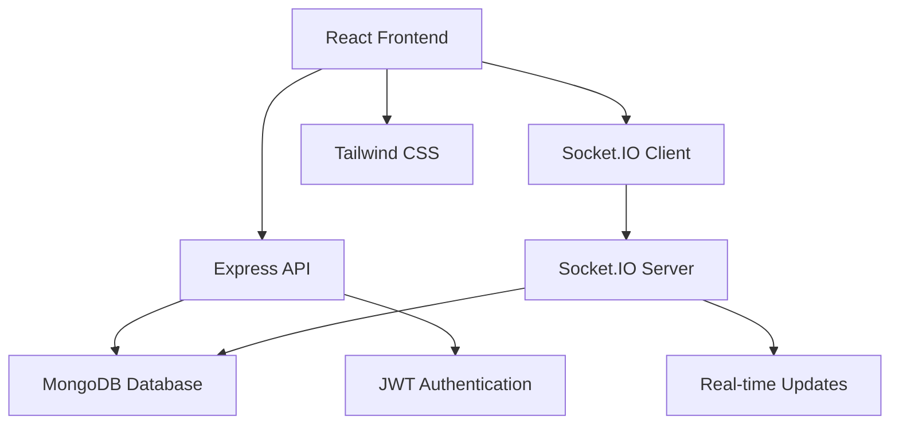
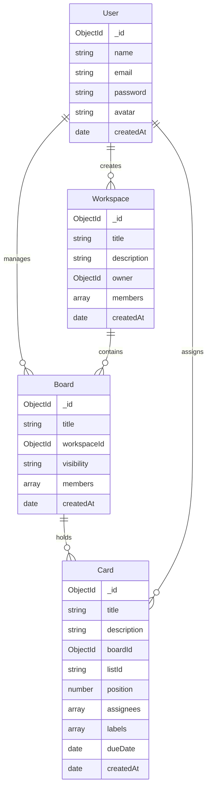

# Kanbanly 🚀

<div align="center">


**A sleek, real-time Kanban board app inspired by Trello**
*Collaborate on workspaces, drag-and-drop cards, and track changes instantly*

[](https://www.youtube.com/watch?v=cemYD8L0RNs)
[](https://www.youtube.com/watch?v=OMKPKcaUgqY)
[](https://github.com/dev-kartikSpace/Mini-Trello-App)

</div>

---

## 🎥 Demo Showcase

### 📱 App Usage Demo
*Experience the intuitive interface and powerful features in action*

<div align="center">

[](https://www.youtube.com/watch?v=cemYD8L0RNs)

**👆 Click to watch the full demo**

</div>

### 👥 Real-time Collaboration Demo  
*See how teams collaborate seamlessly with instant synchronization*

<div align="center">

[](https://www.youtube.com/watch?v=OMKPKcaUgqY)

**👆 Click to watch collaboration in action**

</div>

---

## 📸 Visual Tour

### 🏠 Home Page
*Clean and intuitive landing page with modern design*

<div align="center">
  
</div>

### 📋 Board Interface
*Organized board layout with drag-and-drop functionality*

<div align="center">
  
</div>

### 👥 Team Collaboration
*Real-time collaboration with multiple users*

<div align="center">
  
</div>

---

## ✨ Key Features

<div align="center">

| 🎯 **Core Features** | 🔥 **Advanced** | 🚀 **Performance** |
|:---:|:---:|:---:|
| ✅ Drag & Drop Cards | ⚡ Real-time Sync | 🏃‍♂️ Fast Loading |
| 📋 Multiple Boards | 👥 Team Collaboration | 📱 Mobile Responsive |
| 🏷️ Card Labels | 🔔 Instant Notifications | ⚡ Socket.IO Integration |
| 📝 Rich Text Editing | 🔐 Secure Authentication | 🎨 Modern UI/UX |
| 📅 Due Dates | 📊 Activity Tracking | 🔄 Auto-save |

</div>

---

## 🛠️ Tech Stack

<div align="center">

### **Backend Powerhouse**


### **Frontend Excellence**  


</div>

### 🎯 Architecture Highlights



**Why These Technologies?**
- **🟢 Node.js**: Unified JavaScript environment across full stack
- **⚡ Express.js**: Fast, minimalist web framework for robust APIs
- **🍃 MongoDB**: Flexible document structure perfect for dynamic Kanban data
- **🔌 Socket.IO**: Real-time bidirectional communication for instant collaboration
- **⚛️ React 18**: Modern hooks and context for efficient state management
- **🎨 Tailwind CSS**: Utility-first approach for rapid, consistent styling

---

## 🚀 Quick Start

### **Prerequisites**
- 📦 Node.js v18+ 
- 🍃 MongoDB (Local or Atlas)
- 🔧 Git
- 📝 Code Editor

### **⚡ Installation**

1. **Clone & Navigate**
   ```bash
   git clone https://github.com/dev-kartikSpace/Mini-Trello-App.git
   cd Mini-Trello-App
   ```

2. **Environment Setup**
   ```bash
   # Create environment file
   cp .env.example .env
   ```
   
   **Configure your .env:**
   ```env
   # Database
   MONGO_URI=mongodb://localhost:27017/kanbanly
   
   # Authentication
   JWT_SECRET=your-super-secret-jwt-key
   JWT_EXPIRE=7d
   
   # Server
   PORT=5001
   NODE_ENV=development
   CLIENT_URL=http://localhost:5173
   ```

3. **Install Dependencies**
   ```bash
   npm install
   ```

4. **Start Backend** 🔧
   ```bash
   cd backend
   npm run dev
   ```
   ✅ Backend running at `http://localhost:5001`

5. **Launch Frontend** ⚛️
   ```bash
   # New terminal
   cd frontend  
   npm run dev
   ```
   ✅ Frontend running at `http://localhost:5173`

6. **🎉 You're Ready!**
   Open `http://localhost:5173` and start organizing!

---

## 📁 Project Structure

```
kanbanly/
├── 🏗️ backend/                 # Server-side application
│   ├── 🎮 controllers/         # Business logic handlers
│   ├── 🛡️ middleware/          # Auth & validation
│   ├── 📊 models/              # MongoDB schemas
│   ├── 🛣️ routes/              # API endpoints
│   ├── 🔌 socket/              # Real-time handlers
│   └── 🚀 server.js            # App entry point
├── ⚛️ frontend/                # React application
│   ├── 🧩 src/components/      # Reusable components
│   ├── 📄 src/pages/           # Route components
│   ├── 🪝 src/hooks/           # Custom hooks
│   ├── 🌐 src/context/         # State management
│   └── 🎨 src/assets/          # Images & media
├── 📸 assets/                  # Project screenshots
└── 📚 docs/                    # Documentation
```

---

## 🗄️ Database Architecture

<div align="center">



</div>

---

## 🤝 Contributing

We love contributions! Here's how to get involved:

### **🔄 Development Workflow**
1. 🍴 Fork the repository
2. 🌿 Create your feature branch
   ```bash
   git checkout -b feature/amazing-feature
   ```
3. 💾 Commit your changes
   ```bash
   git commit -m 'Add some amazing feature'
   ```
4. 📤 Push to the branch
   ```bash
   git push origin feature/amazing-feature
   ```
5. 🔄 Open a Pull Request

### **📋 Code Guidelines**
- Follow ESLint configuration
- Write meaningful commit messages
- Add JSDoc comments
- Include tests for new features
- Ensure responsive design

### **🐛 Found a Bug?**
[Create an issue](https://github.com/dev-kartikSpace/Mini-Trello-App/issues) with:
- Clear description
- Steps to reproduce
- Expected behavior
- Screenshots if applicable

---

## 📚 Documentation

<div align="center">

| 📖 **Resource** | 🔗 **Link** |
|:---:|:---:|
| High-Level Design | [HLD.md](./docs/HLD.md) |
| Low-Level Design | [LLD.md](./docs/LLD.md) |
| API Documentation | [API.md](./docs/API.md) |
| Contributing Guide | [CONTRIBUTING.md](./CONTRIBUTING.md) |

</div>

---

<div align="center">

### **⭐ Show Your Support**

If this project helped you, please consider giving it a star!

[](https://github.com/dev-kartikSpace/Mini-Trello-App/stargazers)
[](https://github.com/dev-kartikSpace/Mini-Trello-App/network)
[](https://github.com/dev-kartikSpace/Mini-Trello-App/issues)

**Ready to revolutionize your project management? Let's get started! 🚀**

</div>
